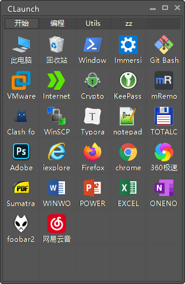

## 自制 CLaunch 皮肤

将皮肤文件夹放到 `CLaunch/Skins` 目录中即可

- [Photoshop](./Photoshop/)

- [Win8](./Win8/)

## Claunch 默认皮肤微调

- [默认皮肤微调](./Data/README.md)

## 自制 Aida64 传感器面板主题

在 [aida64-theme](./aida64-theme/) 文件夹下

- mini-320x240 

